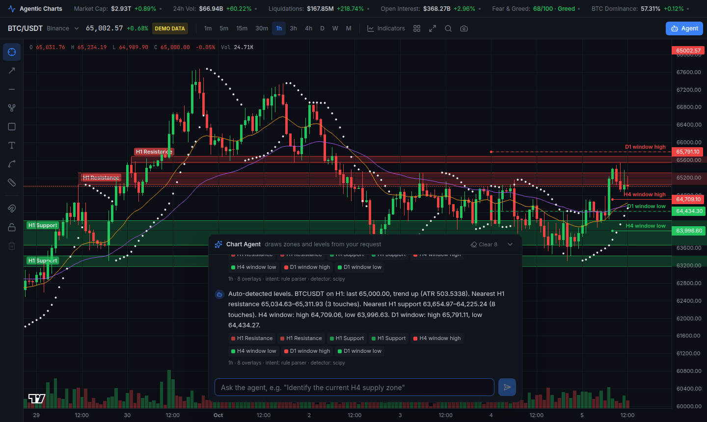

# Agentic Charts

Real-time crypto charting with AI-detected market structure. A dark, TradingView-style
workspace: live Binance candles, a global market header, a manual drawing toolbar, and a
chart agent that turns plain-English requests ("Identify the current H4 supply zone and key
resistance high") into zones, levels and lines drawn on the chart.



## How it works

```
 Browser (Next.js 15 + Lightweight Charts v4)              FastAPI (Python 3.11+)
 ┌───────────────────────────────────────────┐            ┌─────────────────────────────────────┐
 │ MarketHeader ── GET /api/market/metrics ──┼──────────▶ │ market_metrics.py  CoinGecko, F&G   │
 │ AgenticChart ── GET /api/klines ──────────┼──────────▶ │ market_data.py     Binance REST     │
 │              ── WS  /ws/klines ───────────┼──────────▶ │ stream_hub.py      Binance WS fan-out│
 │ AgentPanel ──── POST /api/agent/analyze ──┼──────────▶ │ agent.py                            │
 │   ▲ overlays JSON → custom primitives     │            │   llm.py      prompt → intent (JSON)│
 │   BoxZone / LabeledRay / TrendLine        │            │   ta_agent.py SciPy detectors       │
 │ DrawingLayer (user drawings)              │            │   llm.py      facts → summary       │
 └───────────────────────────────────────────┘            └─────────────────────────────────────┘
```

The LLM never invents prices. It only chooses which detectors to run (via a JSON-schema
structured output) and phrases the result. Every level comes from the SciPy engine, and
the whole pipeline works with no LLM at all (a keyword parser and templated summary take over).

## Project structure

```
agentic-charts/
├── backend/
│   ├── app/
│   │   ├── main.py            FastAPI app: REST + WebSocket routes
│   │   ├── ta_agent.py        Swings, S/R clustering, supply/demand, window levels, trendlines
│   │   ├── agent.py           prompt → intent → data → detectors → summary
│   │   ├── llm.py             Ollama / OpenAI-compatible / Anthropic structured outputs + rule fallback
│   │   ├── market_data.py     Binance klines (paginated, 3h resampled), synthetic fallback
│   │   ├── stream_hub.py      Shared upstream Binance kline streams, fan-out to browsers
│   │   ├── market_metrics.py  Header metrics (live where free, mocked otherwise)
│   │   ├── schemas.py         Pydantic models (overlay contract)
│   │   └── config.py          Env configuration
│   ├── tests/                 pytest: detectors, API, Binance/LLM payloads (network mocked)
│   ├── requirements.txt
│   └── .env.example
├── frontend/
│   ├── app/                   layout, page, globals.css
│   ├── components/
│   │   ├── AgenticChart.tsx   Chart engine, live feed, overlays, drawing interaction
│   │   ├── ChartWorkspace.tsx State + wiring (tools, indicators, agent, persistence)
│   │   ├── MarketHeader.tsx   Global metrics bar
│   │   ├── ChartHeader.tsx    Ticker, timeframes, indicators, layout, search, screenshot
│   │   ├── DrawingToolbar.tsx Left toolbar
│   │   ├── AgentPanel.tsx     Prompt bar + agent replies
│   │   └── SymbolSearch.tsx   Symbol picker
│   ├── lib/chart/
│   │   ├── primitives/        BoxZone, LabeledRay, TrendLine, DrawingLayer (LWC series primitives)
│   │   └── timeMapper.ts      Time ↔ x mapping for points between/beyond bars
│   ├── lib/                   api client, types, indicators (EMA, Parabolic SAR), formatting
│   └── package.json
└── README.md
```

## Run it locally

Requirements: **Python 3.11+**, **Node.js 18.18+** (20 or 22 recommended).
Optional: **[Ollama](https://ollama.com)** for the local LLM.

### 1. Backend

```bash
cd backend
python3 -m venv .venv
source .venv/bin/activate            # Windows: .venv\Scripts\activate
pip install -r requirements.txt
cp .env.example .env                 # edit if needed
uvicorn app.main:app --reload --port 8000
```

Check it: <http://localhost:8000/api/health> and the interactive docs at <http://localhost:8000/docs>.

### 2. Frontend

```bash
cd frontend
npm install
cp .env.example .env.local           # points at http://localhost:8000
npm run dev
```

Open <http://localhost:3000>.

For a production build: `npm run build && npm start`.

### 3. (Optional) AI model

The agent works without any model. To let an LLM interpret free-form requests and write the summary:

**Local, Ollama (default provider):**

```bash
ollama pull llama3.1:8b              # or qwen2.5:7b, mistral, etc.
# backend/.env
LLM_PROVIDER=ollama
OLLAMA_MODEL=llama3.1:8b
```

**Cloud, any OpenAI-compatible API (OpenAI, Groq, Together, LM Studio, vLLM):**

```bash
LLM_PROVIDER=openai
OPENAI_API_KEY=sk-...
OPENAI_MODEL=gpt-4o-mini
OPENAI_BASE_URL=https://api.openai.com/v1
```

**Cloud, Anthropic:**

```bash
LLM_PROVIDER=anthropic
ANTHROPIC_API_KEY=sk-ant-...
ANTHROPIC_MODEL=claude-sonnet-5-5
```

If the model is unreachable or returns invalid JSON, the backend logs a warning, falls back to
the rule parser for that request, and skips the LLM for 30 seconds.

## Configuration

| Variable | Default | Notes |
|---|---|---|
| `DATA_SOURCE` | `auto` | `auto` = Binance with synthetic fallback, `binance`, or `synthetic` (offline demo) |
| `BINANCE_REST_URL` | `https://api.binance.com` | US users: `https://api.binance.us` or `https://data-api.binance.vision` |
| `BINANCE_WS_URL` | `wss://stream.binance.com:9443/ws` | Pair with the REST host (`wss://stream.binance.us:9443/ws` or `wss://data-stream.binance.vision/ws`) |
| `LLM_PROVIDER` | `ollama` | `ollama`, `openai`, `anthropic`, `none` |
| `CORS_ORIGINS` | `http://localhost:3000,...` | Comma-separated frontend origins |
| `METRICS_CACHE_SECONDS` | `60` | Header metrics cache |
| `NEXT_PUBLIC_API_URL` | `http://localhost:8000` | Frontend → backend |
| `NEXT_PUBLIC_WS_URL` | derived from API URL | Override for proxies |

When Binance is unreachable the header shows a yellow **DEMO DATA** badge and the chart runs on a
deterministic synthetic feed, so the UI is never blank. Binance returns HTTP 451 to US IPs; use the
`binance.us` or `binance.vision` hosts above.

## API

| Method | Path | Purpose |
|---|---|---|
| GET | `/api/health` | Status, data source, LLM provider, active streams |
| GET | `/api/klines?symbol=INJUSDT&interval=4h&limit=500` | Historical candles (`3h` is resampled from `1h`) |
| GET | `/api/symbols` | Tradable USDT spot pairs |
| GET | `/api/market/metrics` | Header metrics, each tagged `live` or `mock` |
| POST | `/api/agent/analyze` | `{symbol, interval, prompt, candles?}` → overlays + summary |
| WS | `/ws/klines?symbol=INJUSDT&interval=4h` | `{type:"kline", candle, closed, source}` and `{type:"status"}` messages |

Example:

```bash
curl -s localhost:8000/api/agent/analyze -H 'content-type: application/json' \
  -d '{"symbol":"INJUSDT","interval":"4h","prompt":"Identify the current H4 supply zone and key resistance high"}'
```

```json
{
  "overlays": [
    { "type": "box", "label": "H4 Resistance", "price_high": 7.90, "price_low": 7.70, "color": "rgba(239, 68, 68, 0.22)", "kind": "resistance" },
    { "type": "box", "label": "H4 Supply (fresh)", "price_high": 8.16, "price_low": 7.98, "color": "rgba(249, 115, 22, 0.18)", "kind": "supply" },
    { "type": "horizontal_line", "label": "H4 window high", "price": 8.70, "color": "#ef4444", "time_start": 1759636800 }
  ],
  "summary": "INJUSDT on H4: ... Nearest H4 resistance 7.70–7.90 (3 touches) ...",
  "intent": { "features": ["support_resistance", "supply_demand", "window_levels"], "timeframe": "4h", "max_zones": 1 },
  "engine": { "intent": "ollama:llama3.1:8b", "summary": "ollama:llama3.1:8b", "detector": "scipy" }
}
```

Overlay types: `box`, `horizontal_line`, `trendline`, `marker` (see `backend/app/schemas.py` and
`frontend/lib/types.ts`).

## Detection methods (`ta_agent.py`)

- **Swing highs/lows:** `scipy.signal.find_peaks` on highs and inverted lows, with prominence ≥ 1 ATR and a minimum bar distance. Each swing is tagged HH/LH/HL/LL against the previous one.
- **Support/resistance zones:** complete-linkage hierarchical clustering of swing prices (`scipy.cluster.hierarchy`) with a 0.6 ATR threshold; adjacent bands are merged (up to 1.5 ATR tall). Scored by touches, recency and prominence; the best zones above and below price are kept.
- **Supply/demand zones:** a base of up to 3 small-bodied candles followed by an impulse ≥ 1.6 ATR. Zones a later candle has closed through are discarded; untested ones are marked "fresh".
- **Window highs/lows:** the high and low of the last completed H4 / D1 (or requested) candle, drawn as rays from that candle.
- **Trendlines:** through the two latest swing highs (if falling) and swing lows (if rising), extended right.

## Using the app

- **Agent:** press `/` or click **Agent**, then type a request or tap a suggestion. Mention a timeframe ("H4", "daily") to analyse it regardless of the chart's timeframe. **Clear** removes AI overlays. With **Auto AI levels** on (layout menu), key levels are drawn whenever the symbol or timeframe changes.
- **Drawing tools:** Trendline `T`, Horizontal ray `H`, Fibonacci `F`, Rectangle `R`, Text `N`, XABCD pattern `P`, Measure `M`. Click to place points; `Esc` cancels. In crosshair mode, click a drawing to select it, drag to move it, `Delete` to remove it. Magnet snaps to the nearest OHLC price; Lock freezes drawings. Drawings are saved per symbol in the browser.
- **Indicators:** EMA 20, EMA 50, Parabolic SAR, Volume. **Layout:** log scale, grid, auto levels. The camera button saves a PNG.

## Tests

```bash
cd backend && pip install -r requirements-dev.txt && pytest -q
cd frontend && npm run typecheck && npm run lint && npm run build
```

## Production notes

- Run the API with several workers behind a reverse proxy that supports WebSockets, e.g. `uvicorn app.main:app --host 0.0.0.0 --port 8000 --workers 2` (each worker keeps its own Binance upstreams).
- Set `CORS_ORIGINS` and `NEXT_PUBLIC_API_URL` / `NEXT_PUBLIC_WS_URL` to your real domains (`wss://` behind TLS).
- Liquidations and open interest are mocked because free keyless aggregate sources don't exist; plug a CoinGlass (or similar) key into `market_metrics.py` to make them live.
- Nothing here is financial advice; detections are heuristics.
