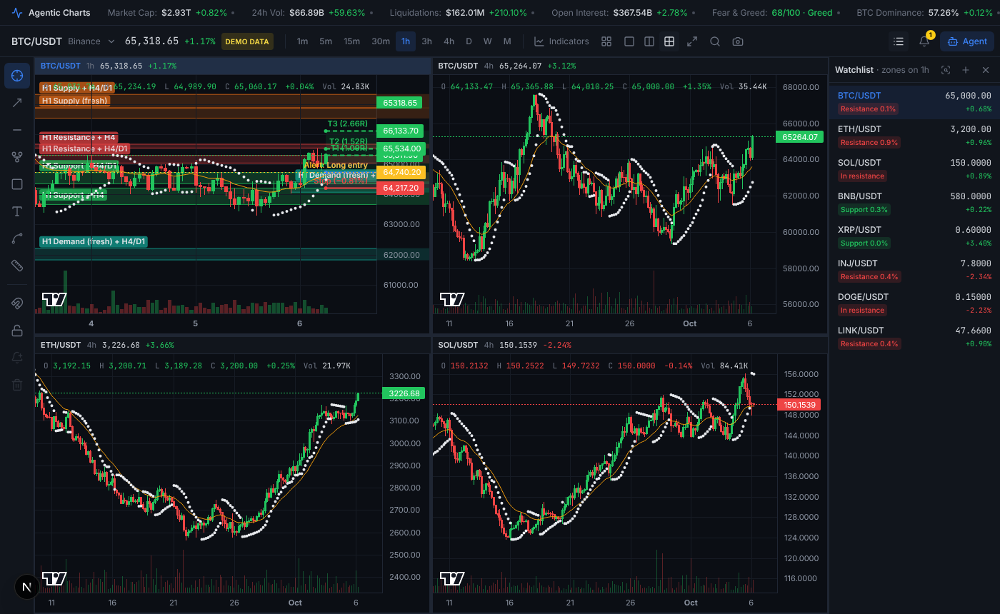

# Agentic Charts

Real-time crypto charting with AI-detected market structure. A dark, TradingView-style
workspace: live Binance candles, a global market header, a manual drawing toolbar, a watchlist,
up to four charts side by side, and a chart agent that turns plain-English requests ("Identify the
current H4 supply zone and key resistance high", "open ETH on the daily", "which of my coins is
sitting in demand?", "give me a long setup") into zones, levels, trade plans and alerts drawn on
the chart.




## How it works

```
 Browser (Next.js 15 + Lightweight Charts v4)              FastAPI (Python 3.11+)
 ┌───────────────────────────────────────────┐            ┌─────────────────────────────────────┐
 │ MarketHeader ── GET /api/market/metrics ──┼──────────▶ │ market_metrics.py  CoinGecko, F&G   │
 │ AgenticChart ── GET /api/klines ──────────┼──────────▶ │ market_data.py     Binance REST     │
 │              ── WS  /ws/klines ───────────┼──────────▶ │ stream_hub.py      Binance WS fan-out│
 │ AgentPanel ──── POST /api/agent/analyze ──┼──────────▶ │ agent.py                            │
 │   ▲ overlays JSON → custom primitives     │            │   agent_loop.py tools → intent      │
 │   BoxZone / LabeledRay / TrendLine        │            │   ta_agent.py   SciPy detectors     │
 │ DrawingLayer (user drawings)              │            │   trade_plan.py entry/stop/targets  │
 │ Watchlist ───── GET /api/watchlist/scan ──┼──────────▶ │ scanner.py      zones per coin      │
 │ AlertsPanel ─── WS  /ws/alerts ───────────┼──────────▶ │ alerts.py       Telegram / Discord  │
 └───────────────────────────────────────────┘            └─────────────────────────────────────┘
```

The LLM never invents prices. It plans: it can look at any coin or timeframe, scan the watchlist
and read funding and open interest through read-only tools, then calls `draw_on_chart` with a
JSON-schema plan saying which detectors to run, which chart to show and what to alert on. Every
level, zone and trade plan price comes from the SciPy engine, and the whole pipeline works with no
LLM at all (a keyword parser and templated summary take over).

## Project structure

```
agentic-charts/
├── backend/
│   ├── app/
│   │   ├── main.py            FastAPI app: REST + WebSocket routes
│   │   ├── ta_agent.py        Swings, S/R clustering, supply/demand, window levels, trendlines, HTF confluence
│   │   ├── indicators.py      RSI, MACD, divergences, structure breaks (BOS/CHoCH), volume profile, VWAP
│   │   ├── patterns.py        Liquidity sweeps, fair value gaps, order blocks, ranges, triangles, double tops
│   │   ├── trade_plan.py      Entry / stop / targets built from detected levels
│   │   ├── kimi/              Kimi Cooked v5.7.4, the Python port of Trick's Pine Script indicator
│   │   ├── kimi_service.py    Runs Kimi Cooked on closed candles, builds its drawing and tables, caches per candle
│   │   ├── agent.py           prompt → intent → data → detectors → summary
│   │   ├── agent_loop.py      Tool-calling planner (look at any chart, scan watchlist, read funding/OI)
│   │   ├── llm.py             Ollama / OpenAI-compatible / Anthropic structured outputs + rule fallback
│   │   ├── symbols.py         "eth", "solana", "$NEAR" → Binance pairs
│   │   ├── scanner.py         Watchlist scan and tickers
│   │   ├── market_data.py     Binance klines (paginated, 3h resampled), synthetic fallback
│   │   ├── candle_store.py    SQLite candle cache (only new bars are downloaded)
│   │   ├── ratelimit.py       Per-client rate limits and a daily agent cap
│   │   ├── stream_hub.py      Shared upstream Binance kline streams, fan-out to browsers
│   │   ├── market_metrics.py  Header metrics (CoinGecko, Fear & Greed, Binance futures)
│   │   ├── derivatives.py     Open interest + rolling 24h liquidations from Binance futures
│   │   ├── alerts.py          Server-side price alerts, Telegram / Discord notifications
│   │   ├── schemas.py         Pydantic models (overlay contract)
│   │   └── config.py          Env configuration
│   ├── tests/                 pytest: detectors, API, conversation, payloads (mocked) + opt-in live checks
│   ├── evals/                 Prompt → plan cases for the rule parser and any LLM provider
│   ├── Dockerfile
│   ├── requirements.txt
│   └── .env.example
├── frontend/
│   ├── app/                   layout, page, globals.css
│   ├── components/
│   │   ├── AgenticChart.tsx   Chart engine, live feed, overlays, drawing interaction, RSI/MACD panes
│   │   ├── ChartWorkspace.tsx State + wiring (grid, watchlist, tools, indicators, agent, persistence)
│   │   ├── ChartCell.tsx      One chart in the 1/2/4 grid
│   │   ├── Watchlist.tsx      Watchlist sidebar with prices and nearest-zone badges
│   │   ├── AlertsPanel.tsx    Alerts list and notification channel status
│   │   ├── MarketHeader.tsx   Global metrics bar
│   │   ├── ChartHeader.tsx    Ticker, timeframes, indicators, layout, search, screenshot
│   │   ├── DrawingToolbar.tsx Left toolbar
│   │   ├── AgentPanel.tsx     Prompt bar + agent replies
│   │   └── SymbolSearch.tsx   Symbol picker
│   ├── lib/chart/
│   │   ├── primitives/        BoxZone, LabeledRay, TrendLine, DrawingLayer (LWC series primitives)
│   │   └── timeMapper.ts      Time ↔ x mapping for points between/beyond bars
│   ├── lib/                   api client, types, indicators (EMA, SAR, RSI, MACD, VWAP), IndexedDB candle cache
│   ├── Dockerfile
│   └── package.json
├── docker-compose.yml
└── README.md
```

## Run it locally

Requirements: **Python 3.11+**, **Node.js 18.18+** (20 or 22 recommended).
Optional: **[Ollama](https://ollama.com)** for the local LLM.

With Docker Desktop instead (Windows, Mac or Linux): `docker compose up -d --build` in the repo root,
then open <http://localhost:3000>. Settings go in `backend/.env`. An Ollama app installed on the same
computer is found at `host.docker.internal:11434` and keeps using its GPU.

### 1. Backend

```bash
cd backend
python3 -m venv .venv
source .venv/bin/activate            # Windows: .venv\Scripts\activate
pip install -r requirements.txt
cp .env.example .env                 # edit if needed
uvicorn app.main:app --reload --port 8000
```

Check it: <http://localhost:8000/api/health> and the interactive docs at <http://localhost:8000/docs>.

### 2. Frontend

```bash
cd frontend
npm install
cp .env.example .env.local           # points at http://localhost:8000
npm run dev
```

Open <http://localhost:3000>.

For a production build: `npm run build && npm start`.

### 3. (Optional) AI model

The agent works without any model. To let an LLM interpret free-form requests and write the summary:

**Local, Ollama (default provider):**

```bash
ollama pull llama3.1:8b              # or qwen2.5:7b, mistral, etc.
# backend/.env
LLM_PROVIDER=ollama
OLLAMA_MODEL=llama3.1:8b
```

**Cloud, any OpenAI-compatible API (OpenAI, Groq, Together, LM Studio, vLLM):**

```bash
LLM_PROVIDER=openai
OPENAI_API_KEY=sk-...
OPENAI_MODEL=gpt-4o-mini
OPENAI_BASE_URL=https://api.openai.com/v1
```

**Cloud, Anthropic:**

```bash
LLM_PROVIDER=anthropic
ANTHROPIC_API_KEY=sk-ant-...
ANTHROPIC_MODEL=claude-sonnet-5-5
```

By default (`AGENT_MODE=tools`) the model gets up to `AGENT_MAX_STEPS` tool calls to look at other
timeframes or coins, scan the watchlist or check funding and open interest before it decides what to
draw; the agent panel lists those steps. Anthropic and OpenAI models force a tool call; Ollama models
need tool support (llama3.1, qwen2.5, mistral-nemo). `AGENT_MODE=single` skips the tools and asks for
the plan in one call. If the model is unreachable, has no tool support or returns invalid JSON, the
backend logs a warning, falls back to the single-call plan and then the rule parser, and skips the LLM
for 30 seconds.

## Configuration

| Variable | Default | Notes |
|---|---|---|
| `DATA_SOURCE` | `auto` | `auto` = Binance with synthetic fallback, `binance`, or `synthetic` (offline demo) |
| `BINANCE_REST_URL` | `https://api.binance.com` | Primary spot host |
| `BINANCE_WS_URL` | `wss://stream.binance.com:9443/ws` | Primary spot stream host |
| `BINANCE_FALLBACK_REST_URL` / `_WS_URL` | `binance.vision` hosts | Used automatically when the primary answers 451/403 (US IPs) |
| `CANDLE_CACHE` / `CANDLE_CACHE_PATH` | `on`, `backend/.cache/candles.sqlite3` | Closed Binance candles kept in SQLite, so restarts only fetch new bars |
| `DERIVATIVES` | `on` | Live open interest and liquidations from Binance futures (`off` to mock them) |
| `OI_TOP_SYMBOLS` | `40` | Open interest sums this many top USDT perpetuals by volume |
| `LLM_PROVIDER` | `ollama` | `ollama`, `openai`, `anthropic`, `none` |
| `OLLAMA_NUM_CTX` | `8192` | Context window requested from Ollama. Its own default on GPUs under 24 GB is 4096, too small for the agent's tool calls (`0` = Ollama's default) |
| `AGENT_MODE` | `tools` | `tools` = the model may look at other charts before drawing, `single` = one planning call |
| `AGENT_MAX_STEPS` | `4` | Tool calls allowed per request before the model must draw |
| `AGENT_RATE_LIMIT` | `20/minute` | Agent requests per client (`0` = off); also `/second`, `/hour`, `/day` |
| `API_RATE_LIMIT` | `300/minute` | All other `/api/` requests per client (`0` = off) |
| `AGENT_DAILY_LIMIT` | `0` | Agent requests per day for the whole server, to cap LLM spend (`0` = off) |
| `TRUST_PROXY` | `0` | Number of reverse proxies in front of the API; the rate limiter then reads the client IP from `X-Forwarded-For` |
| `CORS_ORIGINS` | `http://localhost:3000,...` | Comma-separated frontend origins |
| `METRICS_CACHE_SECONDS` | `60` | Header metrics cache |
| `KIMI_BARS` | `5000` | Closed candles Kimi Cooked runs on (300–5000; `3h` is capped at about 1,600) |
| `ALERTS_STORE` | `backend/.cache/alerts.json` | Where price alerts are saved; `memory` = not saved |
| `TELEGRAM_BOT_TOKEN` / `TELEGRAM_CHAT_ID` | empty | Send fired alerts to Telegram (see [Alerts](#alerts)) |
| `DISCORD_WEBHOOK_URL` | empty | Send fired alerts to a Discord channel |
| `ALERT_HISTORY_STORE` / `SIGNAL_ALERTS_STORE` / `BRIEF_STORE` | `backend/.cache/*.json` | Alert history, signal alerts and brief settings; `memory` = not saved |
| `GRIDBOTS_STORE` | `backend/.cache/gridbots.json` | Saved grid bots; `memory` = not saved |
| `JOURNAL_STORE` | `backend/.cache/journal.json` | Trade journal; `memory` = not saved |
| `BINANCE_API_KEY` / `BINANCE_API_SECRET` | empty | A **read-only** Binance key for the account import (see [Binance account](#binance-account-read-only-key)); wins over a key entered in the app |
| `BINANCE_KEY_STORE` / `BINANCE_IMPORT_STORE` | `backend/.cache/binance_key.json`, `binance_import.json` | Key entered in the app, and imported fills with their classifications (both file mode 600); `memory` = not saved |
| `CALENDAR_URLS` | Forex Factory this week + next week | Economic calendar feeds (JSON, Forex Factory format) |
| `CALENDAR_COUNTRIES` | `USD` | Currencies kept from the calendar, or `ALL` |
| `NEWS_FEEDS` | CoinDesk, Cointelegraph RSS | News feeds (RSS or Atom), comma-separated |
| `NEXT_PUBLIC_API_URL` | `http://localhost:8000` | Frontend → backend |
| `NEXT_PUBLIC_WS_URL` | derived from API URL | Override for proxies |

When Binance is unreachable the header shows a yellow **DEMO DATA** badge and the chart runs on a
deterministic synthetic feed, so the UI is never blank. Binance returns HTTP 451 to US IPs; the
backend then switches to the `binance.vision` market-data hosts by itself.

Header metrics are all live from free, keyless sources: CoinGecko (market cap, volume, BTC
dominance), alternative.me (Fear & Greed) and Binance USD-M futures (open interest across the top
perpetuals, with the change versus 24h ago, and liquidations from the `!forceOrder@arr` stream as a
rolling 24h total saved to `backend/.cache/`). Both futures figures cover Binance only, and Binance
sends at most one liquidation per symbol per second, so that total is a lower bound; hover a metric
for its source. Binance futures has no US-accessible mirror, so from a US IP those two fall back to
mocked values (marked with a dot).

## Alerts

Price alerts are stored and checked by the backend, so they fire with every browser tab closed.
For each symbol with armed alerts the backend watches the live 1m stream and fires an alert once,
when price crosses its level or enters its zone (or gaps through it). A fired alert shows as a
toast, a sound and a desktop notification in any open tab, and is sent to Telegram and/or Discord
when configured. Prices from the synthetic fallback feed never fire alerts (unless
`DATA_SOURCE=synthetic`), so a Binance outage cannot send a false notification.

Each price alert can **repeat** (fire on every new cross instead of once), **expire** after a time you
pick, and carry a **note** that goes into the message. Edit one with the pencil in the Alerts tab, or drag
its amber line or zone on the chart to a new price. **Signal alerts** watch for setups instead of prices
on any coins and timeframe: Kimi Cooked B+/B- labels, RSI divergence, a sweep of a swing high or low, a new
demand or supply zone, a break of structure and more. They are checked on the server when each candle
closes, and **Preview** shows where the signal fired on the last few hundred candles. **History** lists
everything that fired. The **Brief** sends a market summary to Telegram or Discord at the times you pick
(price and change since the last brief per coin, trend, RSI, the nearest zone, Kimi's latest signal and
forecast, funding and open interest, key levels and the day's high-impact economic events); **Preview**
shows it in the app without sending.

**Telegram**

1. In Telegram, message [@BotFather](https://t.me/BotFather), send `/newbot` and follow the prompts. It replies with the bot token (`123456:ABC...`).
2. Open a chat with your new bot and send it any message (for a group, add the bot to the group and post there).
3. Open `https://api.telegram.org/bot<TOKEN>/getUpdates` and copy `"chat":{"id": ...}` (group ids are negative).
4. In `backend/.env`: `TELEGRAM_BOT_TOKEN=...` and `TELEGRAM_CHAT_ID=...`.

**Discord**

1. In your server: **Server Settings > Integrations > Webhooks > New Webhook**, pick the channel, then **Copy Webhook URL**.
2. In `backend/.env`: `DISCORD_WEBHOOK_URL=https://discord.com/api/webhooks/...`.

Restart the backend, open the bell panel in the header and press **Send test**, or run
`curl -X POST localhost:8000/api/alerts/test`. Messages look like
`INJUSDT: price entered 24.10–24.60 (H4 Demand) at 24.32`. Delivery failures are logged (without
the token) and never block other alerts. Alerts created before this version lived in the browser;
they are uploaded once the first time the app connects to a backend that has none.

## Grid bot planner

**Plan** in the Grid bots tab (or ask the agent "plan a grid bot on INJ") suggests a Spot Grid bot for a coin
and says why (`backend/app/grid_planner.py`):

- **Range:** the lower price is the low of the best support or demand zone below price, the upper price the high
  of the best resistance or supply zone above it, from the same detectors the agent draws (on 1h, 4h or 1d, with
  daily confluence). Each edge must sit 1.5–12 ATR from price; without a zone in that band it falls back to the
  30-day low or high, then to 3 ATR.
- **Grid type:** geometric when the upper price is 25% or more above the lower one, else arithmetic.
- **Grids:** about 0.3 ATR per grid, widened until each grid clears the fees by at least 0.3% after both fills,
  and capped so every order stays above Binance's minimum order size.

The proposed range is drawn on the chart in amber while you plan (kept out of the price auto-scale, like the
bots' own grids). Edit anything, then **Last 7/30/90 days** replays it with the tracker's simulator on 1-minute
candles: grid profit, matched trades, grid and total APR, max drawdown, time in range, holding the coin instead
and the bot's value over time, next to the same grid with a few other grid counts (**Use** switches to one).
**Track this bot** saves it as a tracked bot starting now; the app never places orders.

## Binance account (read-only key)

The **Account** tab (and Settings) imports your own Binance fills into the journal and shows your positions,
through an API key that can only read (`binance_account.py`, `binance_import.py`).

- **The key:** on Binance, **Profile > API Management > Create API**, and tick **only "Enable Reading"**: no spot,
  margin, futures or options trading, no withdrawals, no transfers. Before saving the key, and again every hour
  and after any error, the backend asks Binance what it may do (`GET /sapi/v1/account/apiRestrictions`) and
  refuses a key that can trade, withdraw or transfer, or whose permissions it cannot read. The key is stored on
  the backend only (`backend/.cache/binance_key.json`, file mode 600) or comes from `BINANCE_API_KEY` /
  `BINANCE_API_SECRET`; the browser only ever gets its last 4 characters. Requests are signed with HMAC-SHA256
  over the query (with `timestamp` and `recvWindow`), and the clock is re-synced when Binance says it is off.
- **Import:** spot fills (`/api/v3/myTrades`) for the coins in your wallet, your grid bots' pairs and any pairs you
  list, and USD-M futures fills (`/fapi/v1/userTrades`) for every symbol with realized PnL or an open position.
  Each fill is stored once, so re-imports never double up; **Auto-import** repeats it every 5 minutes to daily.
  Fills are rebuilt into round trips (flat → position → flat; futures flips split a round trip), and only your
  own closed round trips go into the journal, with their real entry, exit and PnL after fees. They have no stop,
  so they count in the PnL but not in the R statistics.
- **Mine, bot or unknown:** every fill, holding and position is classified, with the reason shown: your override
  first; then an order placed in Binance's own apps (its `clientOrderId` starts with `web_`, `ios_`, `and_` or
  `electron_`) is yours; a fill on a tracked grid bot's pair, while it ran, on one of its grid lines and with its
  order size is that bot's; any other API order (random or broker `x-` ids) is unknown. Change any of them in the
  Account tab; overrides are saved on the server and the journal follows.
- **Positions:** your spot holdings with the average entry from your own buys, your USD-M positions, and the bots
  apart: the Trading Bots wallet's total, holdings you marked as a bot's, and the tracked bots' simulated holdings.

What is documented and what is inferred: Binance documents the per-wallet balances
(`GET /sapi/v1/asset/wallet/balance`, which lists a "Trading Bots" wallet with its total value only) and the
`clientOrderId` on every order (random when the client does not set one). **Binance has no public API for Spot
Grid bots**, so their settings, orders and fills cannot be read; the grid bot's **Real vs simulated** section only
shows fills on your spot account that match the bot. The app prefixes above, and that bot orders run from the
Trading Bots wallet and so normally don't appear in your spot trade history, are inferred from what responses look
like, not documented. Fees paid in BNB are not converted into the PnL (noted on the trade).

## API

| Method | Path | Purpose |
|---|---|---|
| GET | `/api/health` | Status, data source, LLM provider, active streams |
| GET | `/api/klines?symbol=INJUSDT&interval=4h&limit=500` | Historical candles (`3h` is resampled from `1h`); `&since=<unix s>` returns only bars from that time on |
| GET | `/api/symbols` | Tradable USDT spot pairs |
| GET | `/api/market/metrics` | Header metrics, each tagged `live` or `mock` |
| GET | `/api/tickers?symbols=BTCUSDT,ETHUSDT` | Last price and 24h change per symbol |
| GET | `/api/watchlist/scan?symbols=BTCUSDT,ETHUSDT&interval=4h` | Per symbol: trend, RSI, nearest zone and its distance, signals (cached 60s) |
| GET | `/api/indicators/kimi?symbol=INJUSDT&interval=4h` | Kimi Cooked v5.7.4 on the closed candles: S/R levels with odds, Fib ladder, signals with outcomes, forecast path and band, and its PATH VERIFY and Signal Stats tables |
| POST | `/api/agent/analyze` | `{symbol, interval, prompt, candles?, history?, overlays?, previous_intent?, watchlist?}` → overlays, summary, alerts, and when relevant `navigate` (chart to switch to), `plan`, `scan`, `indicators`, `steps` |
| GET | `/api/alerts` | `{alerts, channels: {telegram, discord}}` |
| POST | `/api/alerts` | `{symbol, alerts: [{kind: "cross"\|"zone", price?, price_low?, price_high?, label}]}` → created alerts |
| DELETE | `/api/alerts/{id}` | Delete an alert |
| POST | `/api/alerts/{id}/rearm` | Re-arm a fired alert |
| POST | `/api/alerts/clear-triggered` | Delete all fired alerts |
| POST | `/api/alerts/test` | Send a test message to the configured channels → `{results: {telegram: true}}` |
| PATCH | `/api/alerts/{id}` | Edit `price`, `price_low`/`price_high`, `label`, `note`, `repeat` or `expires_at` |
| GET/DELETE | `/api/alerts/history` | What fired (price alerts, signals, briefs), newest first; DELETE clears it |
| GET/POST | `/api/signal-alerts` | Signal alerts and the list of signals; POST `{symbols, interval, signal, repeat, note}` |
| PATCH/DELETE | `/api/signal-alerts/{id}` | Arm or disarm, repeat, note; delete |
| GET | `/api/signal-alerts/preview?symbol=&interval=&signal=` | Where the signal fired on past candles |
| GET/PUT | `/api/brief/settings` | Brief schedule, time zone, coins, timeframe and sections |
| GET | `/api/brief/preview` | The brief as it would be sent now |
| POST | `/api/brief/send` | Send the brief now |
| WS | `/ws/klines?symbol=INJUSDT&interval=4h` | `{type:"kline", candle, closed, source}` and `{type:"status"}` messages |
| WS | `/ws/alerts` | `{type:"snapshot", alerts}` on connect and on every change, `{type:"fired", alert, price}`, `{type:"signal_snapshot"}`, `{type:"signal_fired", alert, text, price, time}`, `{type:"history", item}` |
| POST | `/api/gridbot/simulate` | Grid bot settings (`symbol, lower, upper, grids, grid_type, investment, runtime` or `start_time`, fees, trigger/TP/SL) → PnL, matched trades, APR, orders, fills; nothing saved |
| GET/POST | `/api/gridbots` | Saved grid bots; POST `{name?, params, binance?}` → `{bot, result}` |
| PATCH/DELETE | `/api/gridbots/{id}` | Edit or delete a saved bot |
| GET | `/api/gridbots/{id}/result` | A saved bot's current numbers (recomputed at most once per 1m bar) |
| POST | `/api/gridbot/plan` | `{symbol, investment?, timeframe?, grid_type?}` → suggested range, grids, type, reasoning, warnings |
| POST | `/api/gridbot/backtest` | `{symbol, lower, upper, grids, grid_type, investment, days (1–90), compare_grids?}` → profit, matched trades, APR, max drawdown, time in range, value curve, other grid counts |
| GET/PUT/DELETE | `/api/binance/key` | Read-only key status (last 4 characters, permissions); PUT `{api_key, api_secret}` saves it only if Binance reports it read-only |
| POST | `/api/binance/key/test` | Ask Binance again what the key may do |
| GET/POST | `/api/binance/import` | Import status; POST runs an import (new fills, journal added/updated/removed) |
| PUT | `/api/binance/import/settings` | `{auto_minutes, symbols, futures, lookback_days}` |
| GET | `/api/binance/fills?kind=&market=&symbol=` | Imported fills with their classification and reason |
| GET | `/api/binance/trades?kind=` | Round trips rebuilt from the fills |
| POST | `/api/binance/classify` | `{keys, kind ("manual"\|"bot"\|"unknown", null = automatic), bot_id?}` |
| GET | `/api/binance/positions?refresh=` | Your spot holdings and USD-M positions, and the bots' apart |
| GET | `/api/binance/gridbots/{id}/compare` | A tracked bot's real fills next to the simulated ones |
| GET/POST | `/api/journal` | Logged trades with their evaluation; POST a trade `{symbol, interval, direction, entry, stop, targets, …}` |
| PATCH/DELETE | `/api/journal/{id}` | Notes, tags, setup, cancel or close a trade; delete it |
| GET | `/api/journal/stats?symbol=&setup=&direction=` | Win rate, R, expectancy, profit factor, breakdowns, equity curve |
| POST | `/api/backtest` | `{symbol, interval, setup, bars, target, max_hold_bars, fee_pct}` → trades, stats, equity curve |
| GET | `/api/futures/funding`, `/open-interest`, `/long-short`, `/liquidation-levels` `?symbol=` | Futures data for the market data tab (`source`: `binance`, `synthetic` or `unavailable`) |
| GET | `/api/cvd?symbol=&interval=` | Spot taker buy and sell volume per bar and its running sum |
| GET | `/api/orderbook/walls?symbol=&range_pct=5` | Large resting orders near price |
| GET | `/api/calendar?days=7&impact=high` | Economic events |
| GET | `/api/news?symbol=` | Crypto headlines, tagged with the coins they mention |
| GET | `/api/index/klines?name=TOTAL2&interval=4h` | TOTAL, TOTAL2, TOTAL3 market-cap index candles (top 20 coins) |

Example:

```bash
curl -s localhost:8000/api/agent/analyze -H 'content-type: application/json' \
  -d '{"symbol":"INJUSDT","interval":"4h","prompt":"Identify the current H4 supply zone and key resistance high"}'
```

```json
{
  "overlays": [
    { "type": "box", "label": "H4 Resistance", "price_high": 7.90, "price_low": 7.70, "color": "rgba(239, 68, 68, 0.22)", "kind": "resistance" },
    { "type": "box", "label": "H4 Supply (fresh)", "price_high": 8.16, "price_low": 7.98, "color": "rgba(249, 115, 22, 0.18)", "kind": "supply" },
    { "type": "horizontal_line", "label": "H4 window high", "price": 8.70, "color": "#ef4444", "time_start": 1759636800 }
  ],
  "summary": "INJUSDT on H4: ... Nearest H4 resistance 7.70–7.90 (3 touches) ...",
  "intent": { "features": ["support_resistance", "supply_demand", "window_levels"], "timeframe": "4h", "max_zones": 1 },
  "engine": { "intent": "ollama:llama3.1:8b", "summary": "ollama:llama3.1:8b", "detector": "scipy" }
}
```

Overlay types: `box`, `horizontal_line`, `trendline`, `marker` (see `backend/app/schemas.py` and
`frontend/lib/types.ts`). Requests over the rate limit get HTTP 429 with a `Retry-After` header.

## Detection methods (`ta_agent.py`)

- **Swing highs/lows:** `scipy.signal.find_peaks` on highs and inverted lows, with prominence ≥ 1 ATR and a minimum bar distance. Each swing is tagged HH/LH/HL/LL against the previous one.
- **Support/resistance zones:** complete-linkage hierarchical clustering of swing prices (`scipy.cluster.hierarchy`) with a 0.6 ATR threshold; adjacent bands are merged (up to 1.5 ATR tall). Scored by touches, recency and prominence; the best zones above and below price are kept.
- **Supply/demand zones:** a base of up to 3 small-bodied candles followed by an impulse ≥ 1.6 ATR. Zones a later candle has closed through are discarded; untested ones are marked "fresh".
- **Window highs/lows:** the high and low of the last completed H4 / D1 (or requested) candle, drawn as rays from that candle.
- **Trendlines:** through the two latest swing highs (if falling) and swing lows (if rising), extended right.
- **Higher-timeframe confluence:** S/R and supply/demand zones are also detected on the next two timeframes up (H4 → D1, W1). A zone overlapping one of them scores higher and is labelled, e.g. "H4 Demand + D1/W1".
- **Liquidity sweeps:** a wick through a swing high/low that closes back inside (`patterns.py`).
- **Fair value gaps:** three-candle gaps that price has not filled yet. **Order blocks:** the last opposite candle before an impulse that broke structure, while unmitigated.
- **Patterns:** ranges (a flat box that held for 30+ bars), triangles and wedges (lines fitted through swings), double tops/bottoms with their neckline.
- **Volume profile:** point of control and the 70% value area over the loaded bars.
- **Momentum and structure (facts for the agent):** RSI with regular divergences, the last break of structure or change of character, relative volume, funding and open interest.
- **Trade plans (`trade_plan.py`):** the entry is the best-scored support or demand zone below price for a long (resistance or supply above for a short), the stop sits 0.25 ATR beyond it, and targets are the next opposing levels or swing extremes at least 0.8R away. R-multiples are used only when no level lies beyond price. The plan notes when it runs against the trend or the entry is far away.

## Using the app

- **Side panel:** the icons on the right open the chart agent, watchlist, alerts, layers and the other tools in one resizable panel (drag its left edge). Click the open icon again, or press `D`, to close it; the agent then shrinks to a prompt bar at the bottom of the chart, and its latest answer shows above the bar. On a phone the panel covers the chart and the tabs move to the bottom (Chart, Draw, Agent, Watchlist, Alerts, Layers, …).
- **Agent:** press `/` or open the agent tab, then type a request or tap a suggestion. Mention a timeframe ("H4", "daily") to draw its zones on the current chart; say "switch to the daily" or "open ETH on the 1h" to move the chart. Naming another coin ("what about SOL?", "$NEAR supply zones") always opens it. "Which of my coins are near support?" or "scan my watchlist" scans every watchlist coin and lists them; click a row to open it. "Give me a long setup" (or short, or just "setup") draws an entry, stop and targets from detected levels, with a card showing risk and R multiples. "Show RSI" or "hide the MACD" toggles indicators. The agent remembers the conversation and what it drew, so you can follow up: "also show swings", "same on daily", "remove the trendlines", "clear the chart", or give your own prices ("line at 25.4", "zone 24 to 25", "entry at 24.2, stop at 23.8, target at 27"). **Clear** removes AI overlays and the trash icon starts a new conversation. AI overlays are saved per symbol and timeframe and the conversation per symbol, so a reload keeps them. With **Find levels automatically** on (Settings), key levels are drawn when a chart has none saved. A question that doesn't ask for new drawings ("what does Kimi say?", "alert me on these levels") keeps what's on the chart; a new analysis replaces the earlier AI levels unless you pin the answer (the pin under it), which keeps its drawings on that chart until you unpin it. Prices in answers are rounded like the exchange shows them and the key levels are in bold. Trade plans show the position size, risk in dollars, fees and leverage for your account (Settings → Position sizing), and **Copy order** puts the order on the clipboard.
- **Alerts** (`A`): ask the agent ("alert me at 65k", "alert me if price enters the supply zone", "alert me on these levels", "long setup and alert me at the entry"), add one in the Alerts tab, or select a horizontal ray or rectangle and press the bell in the toolbar. Alerts show as amber dotted lines you can drag to a new price, and fire with a sound, a toast and a desktop notification (if allowed). Each can repeat, expire or carry a note. The tab also holds signal alerts, the history of everything that fired, and the scheduled brief (see [Alerts](#alerts)). The backend checks them against live 1m prices, so they also fire with the app closed; set up [Telegram or Discord](#alerts) to hear about those.
- **Drawing tools:** Trendline `T`, Horizontal ray `H`, Fibonacci `F`, Rectangle `R`, Text `N`, XABCD pattern `P`, Measure `M`. Click to place points; `Esc` cancels. In crosshair mode, click a drawing to select it, drag to move it, `Delete` to remove it. Magnet snaps to the nearest OHLC price; Lock freezes drawings. Selecting a drawing shows a style bar: colour, width, solid/dashed/dotted, extend left/right, text size, and which timeframes it shows on ("this timeframe only"); `Ctrl+D` duplicates it. `Ctrl+Z` / `Ctrl+Y` undo and redo drawings and AI levels (also the arrows in the toolbar). Drawings are saved per symbol in the browser.
- **Watchlist:** each coin shows its price, 24h change, a 48-hour sparkline and the nearest zone on the active timeframe ("In demand", "Supply 0.8%"). Keep several named lists (the list name opens a menu to switch, rename, add or delete), drag coins to reorder them, or sort by change, nearest zone or name. Right-click a coin to open it in chart 2, 3 or 4, copy it to another list, or remove it. **+** adds a coin; the scan button asks the agent to rank them.
- **Multiple charts:** the layout buttons in the chart header show 1, 2 or 4 charts. Click a chart to make it active (blue header); the timeframe buttons, toolbar and agent act on the active chart. Each chart keeps its own coin, timeframe and overlays. Hovering one chart shows the same time on the others, and **Every chart follows the same coin** (Settings) keeps one coin across charts with different timeframes. **Layouts** saves the open charts, timeframes, indicators, panels and layer toggles under a name (`Ctrl+S` saves the current one).
- **Indicators:** two EMAs, Bollinger Bands, VWAP, Parabolic SAR, volume and a volume profile of the visible range on the price; RSI, MACD, Stoch RSI, ATR and CVD (taker buy minus sell volume) in panes under it; and Kimi Cooked (below). **Lengths and colours…** in the menu (or `I`) changes their settings. **Compare** draws other coins or the TOTAL indexes over the chart in % change; the ÷ button next to a compared coin opens it as a ratio chart. Search "ETH/BTC" for a ratio chart of any two coins, or "TOTAL" for the market-cap indexes (TOTAL, TOTAL2 without BTC, TOTAL3 without BTC and ETH, built from the top 20 coins). The countdown under the price shows when the candle closes. The camera button saves a PNG.
- **Kimi Cooked v5.7.4:** Trick's own TradingView indicator, run from its Python port (`backend/app/kimi`) on the last 5,000 closed candles. Turn it on in the Indicators menu or ask the agent ("show my Kimi"). It draws what the script draws: S/R zones and rays with the chance price reaches each level within the forecast window, the auto Fib ladder with its odds and golden pocket, the B+/B-, U/Dn and B+?/B-? labels, and the forecast (confidence band, best-guess line, textured scenario path, end label and the next-candle ▲/▼). The **Kimi Cooked** pill under the legend opens the PATH VERIFY and Signal Stats tables and the latest signals with their outcomes. It reruns when a candle closes, like the script since v5.7.4. Ask "what does Kimi say?" and the agent reads its levels, signals and forecast; with an LLM it can also read it on other coins and timeframes. Chart patterns and harmonics are not in the port yet, so those drawings and the Pat BO and Harmonics rows are missing, and confluence scores run a little lower than on TradingView.
- **Caching:** candles are kept in the browser (IndexedDB) and on the backend (SQLite), so opening the app draws the chart from cache at once and only the bars since the last visit are downloaded.
- **Layers:** the layers tab lists what is drawn on the chart by group (agent zones, window levels, structure, trade plan, pinned answers, each part of Kimi Cooked, your drawings, alerts, journal trades, grid bots, …) with an eye toggle each, plus the pinned answers and your drawings. Labels that would overlap move apart.
- **Grid bots** (`B`): track a Binance Spot Grid bot you already run. Copy its settings from Bot details on Binance: pair, lower and upper price, number of grids, arithmetic or geometric, investment and how long it has been running ("3d 4h 12m", or the start time). The app replays the bot on Binance's 1-minute candles from that moment and shows what the bot card shows: total PnL, grid profit, floating PnL, matched trades (all and last 24h), grid and total APR, plus its open orders, recent fills and matched trades per day. Its grid is drawn on the chart. To check it against Binance, type Binance's matched trades, grid profit and total PnL in the form and the bot shows both side by side. **More settings** covers fees (and the BNB discount), trigger price, take profit, stop loss, sell on stop and Binance's "Qty per order". The numbers can differ a little from Binance's: several fills inside one minute are not all seen, and Binance keeps a small fee reserve (enter its qty per order to remove that difference).
- **Grid bot planner:** **Plan** in the Grid bots tab, or "plan a grid bot on INJ" to the agent, suggests a range, grid count and type with the reasons, tests it on the last 7/30/90 days and tracks it in one click (see [Grid bot planner](#grid-bot-planner)).
- **Binance account:** the Account tab imports your own fills into the journal with a read-only API key, shows your positions apart from the bots', and lets you correct what is yours (see [Binance account](#binance-account-read-only-key)).
- **Trade journal** (`J`): **Log trade** on a plan card tracks that plan, sized from your position-sizing settings, and **Add trade** logs your own. Each trade is followed on 1-minute candles: pending until the entry fills, then partial exits at each target (the stop moves to entry after the first), with R, PnL after fees, best and worst excursion. **Stats** shows win rate, average R, expectancy, profit factor, an equity curve and results by setup, coin and direction. Trades show on the chart; close or cancel them by hand when you exit early.
- **Backtest** (`X`): pick a setup (first touch of fresh demand or supply, support or resistance holds, sweeps, Kimi Cooked signals, …), an exit (1.5R, 2R, 3R or the next level), a max hold and fees, and it replays the setup over the last 100–5,000 candles of the chart, with no look-ahead. It shows win rate, average and total R, profit factor, max drawdown, an equity curve and every trade; click a trade to see it on the chart.
- **Market data** (`O`): funding (now, next settlement, annualised, history), open interest, the long/short account ratio and top traders' ratio, 24h spot CVD, the biggest order-book walls within 5% of price, and estimated liquidation clusters (from volume and open interest, assuming common leverage, so treat them as estimates), plus real liquidations from Binance's stream. Walls and liquidation clusters can be shown on the chart.
- **Calendar and news** (`E`): high-impact economic events (Forex Factory, USD by default) and crypto headlines (CoinDesk, Cointelegraph), filtered to the current coin or all. **Show on chart** draws events as dashed lines with their name and headlines as dots at the top of the chart; hover one for the details. The agent knows the calendar too: a trade plan warns when a high-impact event is due within 48 hours, and "any news?" or "what's funding like?" brings in the headlines or the futures data.
- **Settings** (the gear): log scale, grid lines, timezone of the time axis (yours or UTC), the countdown, crosshair sync, linked coins, automatic levels, position sizing, and **Save a backup** / **Restore from a file**, which moves everything the app keeps in the browser (drawings, alerts, chats, watchlists, layouts, settings) to another browser or computer.
- **Keyboard:** press `?` for the full list. `/` asks the agent, `S`, `Space` or `Ctrl+K` searches a coin, `1`–`9` and `0` pick the timeframe, `[` `]` or `Alt+↑` `↓` step through the watchlist, `G` cycles one, two and four charts, `Alt+R` fits the chart, `Alt+L` toggles log scale, `K` toggles Kimi Cooked, and `W` `A` `L` `J` `B` `E` `O` open the panel tabs.

## Tests

```bash
cd backend && pip install -r requirements-dev.txt && pytest -q
cd frontend && npm run typecheck && npm run lint && npm run build

# Against the real APIs (CoinGecko, Fear & Greed, Binance spot + futures):
cd backend && LIVE_TESTS=1 pytest tests/test_live.py -v -rs
```

The agent's planning is checked against `backend/evals/intents.jsonl`, about 50 prompts with the plan
each should produce (features, timeframe, coin, chart switch, alerts, trade plan):

```bash
cd backend
python -m evals.run          # the rule parser; CI runs this through pytest
python -m evals.run --llm    # the configured LLM_PROVIDER, to compare models or prompt changes
```

GitHub Actions runs the unit tests, lint, typecheck and build on every push and PR
(`.github/workflows/ci.yml`), and the live checks weekly and on demand
(`live-smoke.yml`). Binance futures blocks GitHub's US runners, so those checks skip there.

## Deploy

Any small VPS with Docker works (1 vCPU and 1 GB RAM is enough without Ollama). Pick a region where
Binance answers: spot data has a US mirror, but open interest and liquidations come from Binance
futures, which blocks US IPs, so a host in Europe or Asia keeps those live.

1. Point a domain at the server, e.g. `charts.example.com`.
2. On the server:

   ```bash
   git clone https://github.com/66ix/Agentic-Charts.git && cd Agentic-Charts
   cp backend/.env.example backend/.env      # set LLM_PROVIDER and keys, TELEGRAM_* / DISCORD_WEBHOOK_URL
   PUBLIC_ORIGIN=https://charts.example.com PUBLIC_API_URL=https://charts.example.com \
     docker compose up -d --build
   ```

3. Put [Caddy](https://caddyserver.com) in front for HTTPS and one domain. `/etc/caddy/Caddyfile`:

   ```
   charts.example.com {
       @api path /api/* /ws/*
       reverse_proxy @api 127.0.0.1:8000
       reverse_proxy 127.0.0.1:3000
   }
   ```

   Then `sudo systemctl reload caddy`. Caddy gets the certificate by itself.

The compose file binds both containers to `127.0.0.1` so only the proxy reaches them, and sets
`TRUST_PROXY=1` so rate limits apply per visitor. The candle cache, liquidation history and alerts live
in the `backend-cache` volume and survive rebuilds. `NEXT_PUBLIC_API_URL` is baked into the frontend
at build time, so rebuild (`docker compose up -d --build`) after changing `PUBLIC_API_URL`. For a local
model on the server, run `OLLAMA_URL=http://ollama:11434 docker compose --profile ollama up -d` and
`docker compose exec ollama ollama pull llama3.1:8b`; a cloud provider is lighter on a small VPS. A public deployment with a cloud LLM should keep
`AGENT_DAILY_LIMIT` (500 by default in compose) so nobody can run up the bill.

## Production notes

- Run the API as a single worker (the Docker image does). Alerts and the Binance streams run inside the process, so a second worker would fire every alert twice.
- Put it behind a reverse proxy that supports WebSockets, and set `CORS_ORIGINS` and `NEXT_PUBLIC_API_URL` / `NEXT_PUBLIC_WS_URL` to your real domains (`wss://` behind TLS).
- Open interest and liquidations cover Binance only. For cross-exchange totals, plug a CoinGlass (or similar) key into `market_metrics.py`.
- Nothing here is financial advice; detections are heuristics.
